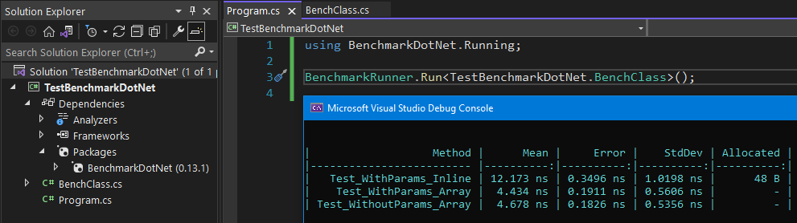

# TestBenchmarkDotNet
Testing the [BenchmarkDotNet](https://github.com/dotnet/BenchmarkDotNet) library.

The main idea that we have a couple of methods and we want to compare memory allocation and execution time.
But we don't want to write a bunch of code.

As a result of the experiment we got the following console output:

